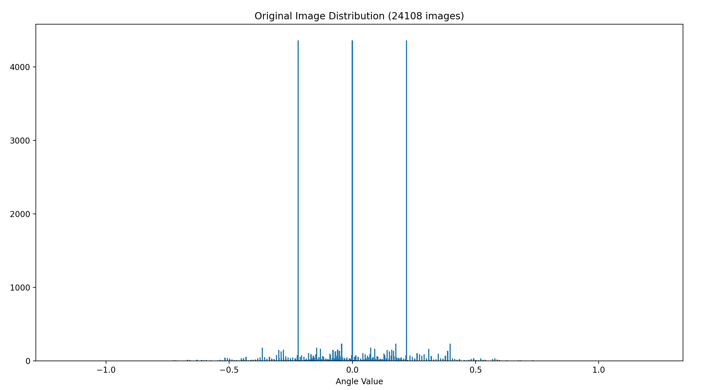
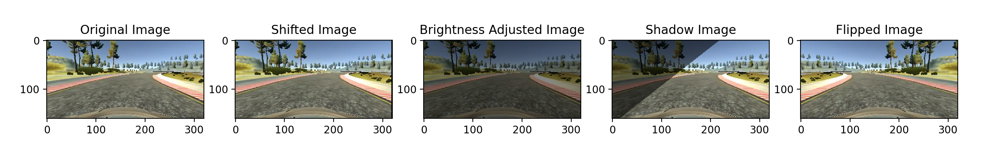
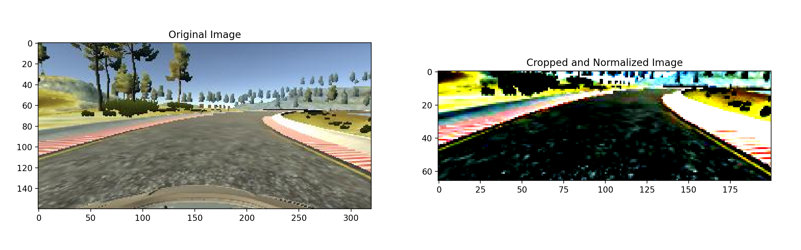

# Behavioral Cloning
Using a provided simulator, a neural network is used to clone the driving behavior of a given user.

## Overview
Using a simulator, we can record the steering angle and speed of a moving car. The car in the simulator has three cameras: left, center and right. This setup is similar to the setup used by the paper published by Nvidia, [End to End Learning for Self-Driving Cars.](https://images.nvidia.com/content/tegra/automotive/images/2016/solutions/pdf/end-to-end-dl-using-px.pdf) The basic idea is to map the image features from the three cameras to an appropriate steering angle. This information is sent to the simulator frame by frame.

<div align="center">

</div>

## Installation & Run
The simulator I used is provided by Udacity (click [here](https://github.com/udacity/self-driving-car-sim) to install the simulator). You can record your own data from the simulator, or you can download the provided dataset from Udacity.

With the simulator installed, you also have to install some dependencies (this was a pain to do). I have provided a .yml file (conda environment) so that you dont have to go through the hassle of installing each package one-by-one. I have done my development on a mac, but using the .yml file should not be an issue on windows or linux.
```python
conda env create -f env.yml
```
I have uploaded a few model weights which you can use straight away. In order to test your model run the drive.py file with a model weight of your choosing:
```python
python drive.py model_name.pth
```
The rest of this repository contains code for creating and training the neural network. I have tried to make it as readable and usable as possible.

## Data Processing
After reading in your data, you can see that the range of steering angles are not balanced. There are way to many 0.0 angle images, which will cause the network to output 0.0 for every single frame. Thus you first have to find a way to balance your dataset. I decided to randomly discard 85% of all 0.0 angles and images from the dataset. This might not be ideal, but it does balance the dataset. In addition, we have to include an offset angle to the left and right camera images. I didn't know how much offset I should I add, but after some googling I decided to offset the left camera angle by +0.22 and the right camera angle by -0.22. The histogram shows the image/angle distribution of the original dataset (left, center and right images). The reason why there is a spike on for angle -0.22, 0.00, and 0.22 is because these are the angles corresponding to the center image where the angle is 0.00.

<div align="center">

</div>

## Data Augmentation
Another issue with the dataset is the limited number of examples. Of course, you could technically record the simulator for hours and hours trying to collect as much data as you can, but thats just not efficient. Therefore, I decided to augment my data to include shiffted, brightness altered, shadowed and flipped images. Im not going to go in detail regarding the procedure to augment images since there is a ton of resources out there on the internet.

<div align="center">
  
  
</div>

After the augmentation, we can see from the histogram, the dataset is much more balanced and ready to be used to train our network. Finally, before inserting my images into the network, I cropped them and normalized them to help increase the speed of training (also to decrease the chances of overfitting).

<div align="center">

</div>

## Model Architecture & Training
I have include 3 different network architecures in the model.py file. The Simple model is simply a very simple convolutional network that is used to demonstrate the lack of effectvieness for simple models. The Nvidia model is my own implementation of the Nvidia model with my own imporvements. And finally, I have also added a model obtained from a different github user to compare their results with mine.

<div align="center">

</div>

The Nvidia paper does not employ any kind of normalization. However, after extensive testing I found that without normalization the network fails to generalize. As a result, I have added normalization for all my convolutional layers. The initial inputs are normalized by the mean and standard deviations employed in the ImageNet dataset. After that, batch normalization is applied. Furthermore, to further decrease any overfitting from occuring, I have also added two dropout layers in my network (one at the end of the convolution layers, and one in the third fully-connected layer).

While training, I found that using 32 epochs produced the best results. Any less will result in underfitting, while any more could lead to overfitting. Moreover, I used the Adam optimizer as well as the MSELoss objective function while training.


